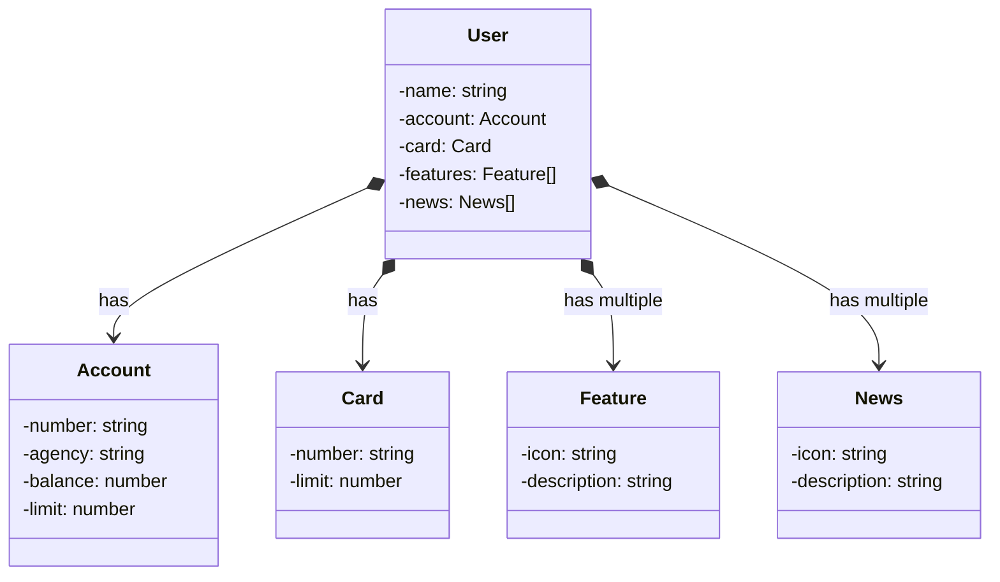

# api-rest-project
Java RESTful API 

## Diagram de Classes

```mermaid
classDiagram
  class User {
    -name: string
    -account: Account
    -card: Card
    -features: Feature[]
    -news: News[]
  }
  class Account {
    -number: string
    -agency: string
    -balance: number
    -limit: number
  }
  class Card {
    -number: string
    -limit: number
  }
  class Feature {
    -icon: string
    -description: string
  }
  class News {
    -icon: string
    -description: string
  }

  User *--> Account : has
  User *--> Card : has
  User *--> Feature : has multiple
  User *--> News : has multiple
```
